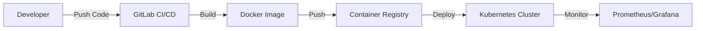

# Architecture Diagrams Directory

This directory contains architecture diagrams and technical visualizations for the DevOps portfolio.

## Diagram Types

### Cloud Architecture
- **aws-eks-architecture.png** - AWS EKS cluster architecture
- **multi-cloud-infrastructure.png** - Multi-cloud setup diagrams
- **azure-architecture.png** - Azure infrastructure diagrams

### CI/CD Pipelines
- **cicd-pipeline-diagram.png** - CI/CD workflow visualizations
- **gitlab-pipeline.png** - GitLab CI/CD pipeline structure
- **deployment-flow.png** - Deployment process diagrams

### System Design
- **microservices-architecture.png** - Microservices design diagrams
- **monitoring-stack.png** - Monitoring & observability architecture
- **network-topology.png** - Network architecture diagrams

### Infrastructure as Code
- **terraform-workflow.png** - Terraform automation flow
- **infrastructure-diagram.png** - IaC architecture

## Recommended Tools for Creating Diagrams

### Online Tools
- **Lucidchart** - Professional diagramming
- **Draw.io (diagrams.net)** - Free, open-source
- **CloudCraft** - AWS architecture diagrams
- **Excalidraw** - Hand-drawn style diagrams

### Code-based Tools
- **Mermaid** - Markdown-based diagrams
- **PlantUML** - UML diagram generation
- **Terraform Graph** - Infrastructure visualization
- **Graphviz** - Graph visualization

## File Specifications

- **Format:** PNG or SVG (SVG preferred for scalability)
- **Dimensions:** 1200x800px minimum for PNG
- **Background:** Transparent or white background
- **Quality:** High-resolution for clarity

## Example Mermaid Diagram (for reference)

## Current Status

🟡 **Placeholder** - Replace ASCII diagrams in HTML with actual image files
